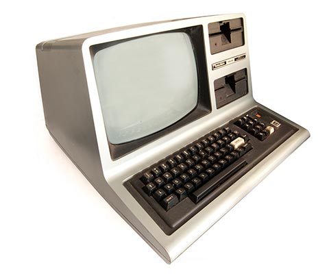

<!DOCTYPE html>
<html>
<head>
<meta charaset = “utf-8”>
	
<!--<title>--<h2>TRS-80</h2></title--> 
</head>
<body>
<h4>Flynn's Retro Computers</h4>
<h1>TRS 80</h1>
	<h4>[Navigation]</h4>
	<h5><h5><a href="Home.md" alt="Home">Home</a></h5></h5>
	<h5><a href="Apple-ii.md" alt="Apple II">Apple II</a></h5>
	<h5><a href="Commodore 64.md" alt="Commodore 64">Commodore 64</a></h5>
	<h5><a href="TRS-80.md" alt="TRS-80">TRS 80</a></h5>

<strong>The TRS-80 Micro Computer System</strong> (TRS-80) is a desktop microcomputer launched in 1977 and sold by Tandy Corporation through their Radio Shack stores. The name is an abbreviation of Tandy/Radio Shack, Z-80 microprocessor. It was one of the earliest mass-produced and mass-marketed retail personal computers.

An extensive line of upgrades and add-on hardware peripherals for the <strong>TRS-80</strong> was developed and marketed by Tandy/Radio Shack. The basic system could be expanded with up to 48 KB of RAM (in 16 KB increments), and up to four floppy disk drives and/or hard disk drives. Tandy/Radio Shack provided full-service support including upgrade, repair, and training services in their thousands of stores worldwide.

<h3>Specifications</h3>
<ul>
	<li>Release Date: July 1980</li>
	<li>Price: $699</li>
	<li>Operating System: BASIC</li>
	<li>CPU: Zilog Z-80</li>
	<li>Memory: 4KB to 48KB</li>
</ul>
</body>
</html>
